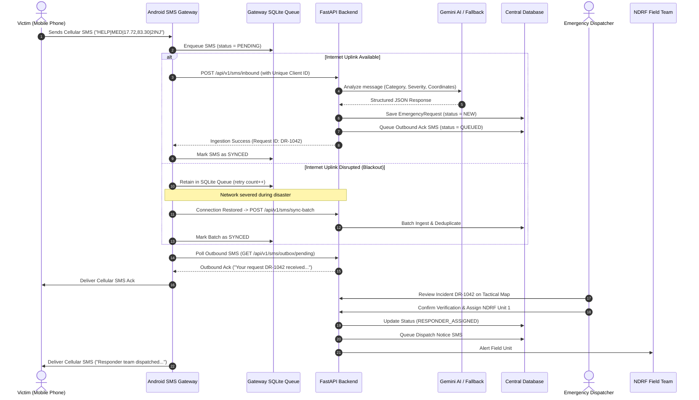

# Data Flow Diagram (DFD)

## Sequence Flow: Inbound Emergency SMS & Store-and-Forward Cycle

```mermaid
sequenceDiagram
    autonumber
    actor Victim as Victim (Mobile Phone)
    participant Gateway as Android SMS Gateway
    participant LocalDB as Gateway SQLite Queue
    participant Backend as FastAPI Backend
    participant AI as Gemini AI / Fallback
    participant CentralDB as Central Database
    actor Operator as Emergency Dispatcher
    participant Responder as NDRF Field Team

    Victim->>Gateway: Sends Cellular SMS ("HELP|MED|17.72,83.30|2INJ")
    Gateway->>LocalDB: Enqueue SMS (status = PENDING)
    
    alt Internet Uplink Available
        Gateway->>Backend: POST /api/v1/sms/inbound (with Unique Client ID)
        Backend->>AI: Analyze message (Category, Severity, Coordinates)
        AI-->>Backend: Structured JSON Response
        Backend->>CentralDB: Save EmergencyRequest (status = NEW)
        Backend->>CentralDB: Queue Outbound Ack SMS (status = QUEUED)
        Backend-->>Gateway: Ingestion Success (Request ID: DR-1042)
        Gateway->>LocalDB: Mark SMS as SYNCED
    else Internet Uplink Disrupted (Blackout)
        Gateway->>LocalDB: Retain in SQLite Queue (retry count++)
        Note over Gateway,Backend: Network severed during disaster
        Gateway->>Backend: Connection Restored -> POST /api/v1/sms/sync-batch
        Backend->>CentralDB: Batch Ingest & Deduplicate
        Gateway->>LocalDB: Mark Batch as SYNCED
    end

    Gateway->>Backend: Poll Outbound SMS (GET /api/v1/sms/outbox/pending)
    Backend-->>Gateway: Outbound Ack ("Your request DR-1042 received...")
    Gateway->>Victim: Deliver Cellular SMS Ack

    Operator->>Backend: Review Incident DR-1042 on Tactical Map
    Operator->>Backend: Confirm Verification & Assign NDRF Unit 1
    Backend->>CentralDB: Update Status (RESPONDER_ASSIGNED)
    Backend->>CentralDB: Queue Dispatch Notice SMS
    Backend->>Responder: Alert Field Unit
    Gateway->>Victim: Deliver Cellular SMS ("Responder team dispatched...")
```
