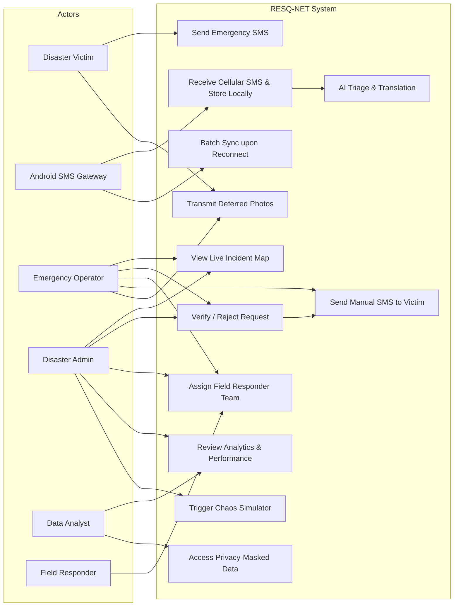

# Use Case Diagram

```mermaid
flowchart LR
    subgraph Actors
        V["Disaster Victim"]
        GW["Android SMS Gateway"]
        OP["Emergency Operator"]
        AD["Disaster Admin"]
        AN["Data Analyst"]
        RT["Field Responder"]
    end

    subgraph System["RESQ-NET System"]
        UC1["Send Emergency SMS"]
        UC2["Receive Cellular SMS & Store Locally"]
        UC3["Batch Sync upon Reconnect"]
        UC4["AI Triage & Translation"]
        UC5["View Live Incident Map"]
        UC6["Verify / Reject Request"]
        UC7["Assign Field Responder Team"]
        UC8["Send Manual SMS to Victim"]
        UC9["Transmit Deferred Photos"]
        UC10["Review Analytics & Performance"]
        UC11["Access Privacy-Masked Data"]
        UC12["Trigger Chaos Simulator"]
    end

    V --> UC1
    V --> UC9
    GW --> UC2
    GW --> UC3

    OP --> UC5
    OP --> UC6
    OP --> UC7
    OP --> UC8
    OP --> UC9

    AD --> UC5
    AD --> UC6
    AD --> UC7
    AD --> UC10
    AD --> UC12

    AN --> UC10
    AN --> UC11

    RT --> UC7
    UC2 --> UC4
    UC6 --> UC8
```
